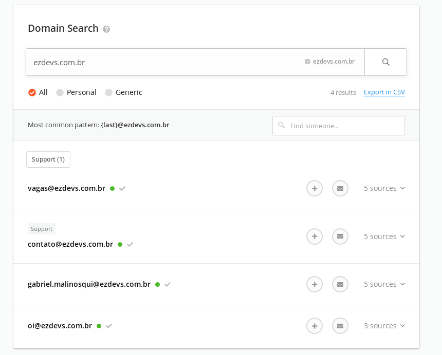

# palestra-ligth-talk
Prospectando clientes ou alvos


## Antes de começar
Esse post tem como meta mostrar soluções que nos ajuda na coleta de informações de pessoas, o elo mais fraco da segurança da informação, com essas informações conseguimos obter, e-mail, cargo, empresa onde trabalha, localização, possíveis tecnologias que a empresa usa, telefone, aniversario, quantidade de funcionários e dependendo da pessoa conseguimos encontrar ainda mais informações.

### O que é prospectar um cliente?
Buscando pela palavra **prospectar** ela tem o significado de fazer pesquisas numa mina, petrolíferas ou jazida de minérios para determinar seu valor. Já quando estamos falando de prospectar um cliente podemos entender como, um processo organizado de forma estruturada na buscar novos clientes para comprar os produtos ou até serviços que sua empresa vende.

### O que é prospectar um alvo ?
Já no ponto de vista de um hacker, a coleta de informações é muito importante. Seja em um pentest que tem autorização, só tem um domínio, precisa coletar o máximo de informações dos funcionários e buscar uma porta de entrada. Essas informações podem ser usadas em ataques de phishing, criar wordlists personalizadas e até usando esses dados para criar contas de laranjas.

## Quais informações são importantes
- e-mails
- contato de telefone
- Tecnologias que uma empresa usa
- Redes sociais

## O uso do e-mail
O envio de e-mail hoje em dia está começando a cair no desuso, por mais que tenham outras formas para entrar em contato, continua sendo uma ótima forma para ter contato com um uma pessoa chave, seja ele o CEO, CTO, finaceiro ou até sysadmins.

Com uma visão de prospectar novos clientes um e-mail pode ajudar em uma abordagem, antes mesmo de entrar em contato via telefone, por mensagem ou até via rede social. Esse tipo de estrategia é usado tanto por pequenas empresas e até grandes multinacionais.

Mas agora visando de um lado de um atacante, esse tipo de contato pode abrir portas para um ataque direcionado, seja usando phishing ou até coleta de informações sensíveis.

### Buscando por e-mails
Atualmente temos diversas formas de conseguir e-mails, tem diversas ferramentas para isso, mas que infelizmente elas acabam interagindo diretamente com os servidores da empresa. Mas com o usado de Open Source Intelligence conseguimos obtê-los da mesma forma.

### Buscando e-mails com hunter.io
Hunter.io é um projeto que nos auxiliar na busca de e-mails de corporações, podemos usar ele tranquilamente com uma conta gratuita (Porem tem um limite) e só precisamos nos cadastrar.
```sh
https://hunter.io/
```

Podemos nos cadastrar no endereço abaixo.
```sh
https://hunter.io/users/sign_up
```

Podemos buscar por e-mails depois que nos logar na aplicação.
```sh
https://hunter.io/search/ezdevs.com.br
```


> Se nos clicarmos em **sources** conseguimos ver onde ele analisou para obter essa informação. Alem de mostrar um possivel cargo.

## A importancia do Linkedin
O Linkedin é uma rede social voltada ao negócios e nela conseguimos encontrar diversas pessoas ligadas a uma empresa.
```sh
https://www.linkedin.com/
```

Assim como toda rede social nem todas as informações estão disponíveis, dessa forma precisamos ser amigos da pessoa para poder obter informações sensíveis e também conseguimos fazer o uso com Python + API deles.

No linkedin conseguimos obter informações de contato e até possíveis tecnologias que a empresa trabalha.

Por exemplo, conseguimos obter
- Email
- Telefone
- Aniversario
- Pessoas com quem trabalha

### lead IQ
Outra solução interessante é o **lead IQ**, com ele conseguimos capturar informações importantes que estão disponiveis no linkedin e ainda criar listar com as informações obtidas. Ele tem uma extensão no navegador chrome que auxilia na captura de contatos, basta entrar na pagina do contato que ele captura as informações disponiveis.
```sh
https://leadiq.com
```

Podemos criar uma conta no seguinte link
```sh
https://account.leadiq.com/app/signin/
```


> Já cadastrado podemos ver a home do aplicativo


> Ele usa uma extensão que fica instalado no navegador google chrome.

Infelizmente devido as configurações de privacidade muitos contatos só vamos conseguir informações se nós tivermos como conexão na rede social.

Vou realizar um teste usando o meu proprio perfil no linkedin e conseguimos ver algumas informações.


> Nem sempre ele nos retorna o email verdadeiro, como por exemplo o que retorna no meu perfil.

Conseguimos informações como
- Social profile
- Email profissional
- dominio do email
- Localização
- Tipo de compania
- Tamanho da empresa
- Dominio da empresa
- Endereço da empresa

> Infelizmente nem todas as informações estão certas, mas já é um grande passo e pode nos ajudar a saber mais cliente/alvo.

> Infelizmente é uma ferramenta paga, mas conseguimos usar uma conta gratuita, temos créditos disponíveis para testar o serviço e é o necessário para realizar algumas pesquisas.

### skrapp
O Skrapp.io é a solução que nos auxilia na extração de informações do Linkedin. Ele tem com uma extenção no chrome, só precisamos estar na pagina do contato que queremos obter a informação e clicar nela que carrega todas as informações disponíveis.
```sh
https://skrapp.io
```

Podemos ver a pagina inicial dele abaixo


> Infelizmente alguns contatos ele não consegue obter e-mails, mas retornas informações legais como:

- Cargo
- Empresa
- Localização
- Email (Mostrando uma porcentagem de ser o verdadeiro, por exemplo 75%)

Ela tambem possui uma extensão para o google chrome, assim nos ajudando na hora do uso. Veja um exemplo de uso abaixo.


No perfil de uma pessoa no linkedin podemos clicar na extensão que fica no topo.


Podemos ver um exemplo de uso com uma pessoa que não tenho amizade no linkedin.


> Além disso é uma ferramenta paga, porem temos como usar ela de forma gratuita, porem temos um limite de créditos.

### get prospect
O **get prospect** é uma solução que nos ajuda na coleta de informações de contatos do linkedin, com ele conseguimos obter informações importantes que podemos usar para prospectar um cliente.
```sh
https://getprospect.io
```

Podemos ver uma imagem da home do projeto


Ele semelhante as soluções que mostramos anteriormente, também usa extensão no google chrome e conseguimos obter informações como:
- Nome e sobrenome
- Informações de contato
- Cargo
- Localização
- Pais
- Resumo
- Empresa
- Website
- Link do linkedin

Com a extensão instalada ao acessar o linkedin vamos ter um botão a mais que é gerado pela aplicação.


Ao pesquisar por palavras chaves tambem conseguimos usar o **get prospect**, ele tambem cria botões e que nos ajuda no uso da solução.


Podemos ver o botão do **GP** em azul.


> E algumas outras informações, mas essas já são necessários para obter informações. Um problema é que precisamos de um e-mail corporativo para usar ele, mas temos como criar contas free.

## Tecnologias
É importante saber quais tecnologias uma empresa usa, na hora de tentar vender um produto conseguimos saber se já trabalhamos com essa tecnologia, caso tenha uma solução melhor já conseguimos mostrar os pros e contras.

Já na visão de um atacante, saber quais tecnologias é usada pode ajudar na coleta de informações e para fazer um ataque direcionado.  

### wappalyzer
Podemos usar o wappalyzer para saber quais tecnologias uma empresa usa, dessa forma conseguimos mapear melhor e estar melhor preparado.

```sh
https://www.wappalyzer.com/
```


Vou realizar um exemplo buscando informaçoes do site da **uber** e ver o que ele nos retorna.


## Buscando mais informações usando motores de busca
Motores de busca pode nos auxiliar na coleta de informações de sites, alem de ter operadores que nos ajudam a filtrar melhor as informações e com poucos operadores já conseguimos trazer informações importantes.

### Google
Google é o maior motor de busca, ele indexa paginas de toda a internet e com ele conseguimos buscar diversas informações.

#### Filtrando site
Vamos começar usando o operador **site**, ele é responsável por filtrar informações de um determinado site, por exemplo:
```sh
site:ezdevs.com.br
```


> Nesse exemplo só está buscando informações do site da ezdevs.com.br

#### Filtrando negação
Alem do operador site, podemos usar o operador **not** com o uso de **-** e assim negando algo.
```sh
site:ezdevs.com.br -reactnative
```
> Dessa forma estamos buscando no site da ezdevs.com.br e negando **reactnative**.


#### Filtrando e trazendo
Com o uso de aspas conseguimos buscar por uma determinada palavra, vou dar o exemplo da busca de palavras que tenhas **@ezdevs.com.br** no site da ezdevs.
```sh
site:ezdevs.com.br "@ezdevs.com.br"
```
> Dessa forma conseguimos trazer possíveis e-mails.


Vamos usar outro exemplo para buscar por possíveis telefones.
```sh
site:ezdevs.com.br "(14)"
```
> Sabendo que **(14)** é o código da região, podemos filtrar por possíveis números e assim coletando possíveis telefones.


## Bonus
Temos algumas soluções que pode nos ajudar, ainda mais quando quando estamos coletando informações de um alvo, pois informações como nomes de usuarios, monitorar vazamentos, analise de tweets e informações publicas.

### haveibeenpwned
O projeto **haveibeenpwned** nos ajuda no reconhecimento de e-mails comprometidos com vazamentos. Basta inserir o e-mail que busca testar e se tiver alguma vulnerabilidade ele nos retorna em qual vazamento a conta foi prejudicada.
```sh
https://haveibeenpwned.com/
```


### PwnedOrNot
Infelizmente diariamente temos vazamento de dados em toda a internet, dessa forma monitorar essas informações podem ser de grande valor e o pwnedOrNot é uma ferramenta que usa informações OSINT para encontrar endereços de email comprometidos.

Podemos encontrar o projeto no github
```sh
https://github.com/thewhiteh4t/pwnedOrNot
```

Ele nos retorna informações como
- Name do branch
- Nome de dominio
- Data do branch
- Estado de vazamento
- Estado de verificação
- Quando foi retirado
- Spam Status

### Sherlock
Procurar usuarios pode ser complicado, mas com o Sherlock que é um projeto que nos auxilia na busca por nomes de usuários nas redes sociais, conseguimos buscar de uma vez se um determinado usuario tem outras redes sociais.
```sh
https://github.com/sherlock-project/sherlock
```
> Ele nos ajuda na busca por mais de **179** sites, testando se um determinado nome de usuario tem uma conta associada.

### Twitter-intelligence
O twitter é uma rede social, se souber monitorar ela usando palavras chaves corretas conseguimos rastrear e analisar o Twitter.
Com o projeto twitter-intelligence conseguimos automatizar a coleta de informações e assim buscando até por leaks disponiveis lá.

Podemos ver mais informaçoes do projeto em
```sh
https://github.com/batuhaniskr/twitter-intelligence
```

Conseguimos filtrar por
- Nome de usuario
- Localização
- Palavras chaves
- Uma determinada data
- E até uma versão web para acessar

## Conclusão
Desde 1930 as tecnicas de OSINT nos ajuda na coleta de informações, tudo começou durante a segunda guerra mundial quando os estados unidos monitoravam os periodicos e a radio da união sovietica. Desde então ela vem ajudando profissionais da segurança da informação, policias, investigadores, vendedores e empresas que buscam esse tipo de informação. Com essas tecnicas o custo operacional é reduzido, mas precisamos ter um profissional que domine do assunto para filtrar as informações obtidas.

Para finalizar, com as tecnicas aprendidas hoje, conseguimos obter e-mails, contato de telefone, quais possiveis tecnoligias uma empresa usa, redes sociais, aniversario, amigos de trabalho, localização, empresa que trabalha, tamanho da empresa, site da empresa, endereço da empresa, cargo e até um possivel resumo.

Informações necessarios para que um possivel vendendor tenha informaçoes chaves de uma determinada empresa, conseguindo falar diretamente com pessoas chaves de uma organização.

Agora de um ponto de vista de um hacker, essas informações tambem teria grande valor, ainda mais quando está realizando o reconhecimento ou até criando um ataque direcionado a um determinado alvo.

Caso precise de ajuda é só deixar nos comentários que vamos responder o mais rápido possível.

Obrigado e até a próxima
